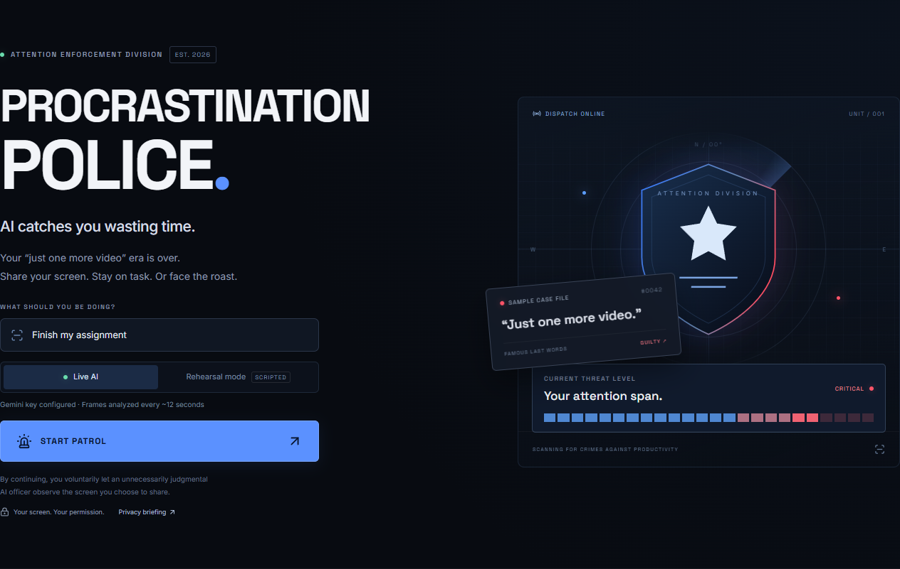

# Procrastination Police 🚨

**AI catches you wasting time.**

Share your screen. Stay on task. Or get arrested by an unnecessarily judgmental AI officer.

Built for the Crazy App Contest, September 29, 2026. A website. No browser extension.



## What is it?

A ridiculous AI productivity patrol with a real feature underneath: browser screen sharing and context-aware screenshot analysis. Watch a SQL tutorial for your SQL assignment and you’re clear. Wander into Ronaldo highlights and the command center becomes an arrest scene, complete with a siren, evidence, sentence, and roast.

## Why does this exist?

Because “just one more video” needed consequences. Also because accountability is more memorable when it has emergency lighting and a Gen-Z cop.

## Demo flow

1. Choose an officer and enter what you should be doing.
2. Click **START PATROL**, then approve a tab, window, or screen in the browser’s real sharing picker.
3. Work normally. The command center shows the shared feed, activity, confidence, score, streak, and evidence timeline.
4. Open clearly unrelated entertainment in the shared source. A confidently distracting verdict triggers **BUSTED!**
5. Read your charge, evidence, sentence, and roast. Dismiss it to continue, or end patrol for **CASE CLOSED**.

## Features

- Real `getDisplayMedia()` sharing, video preview, canvas capture, and compressed JPEG frames.
- Gemini vision with structured JSON output, validated on both server and client.
- Five officers: Indian Mom, Strict Professor, Gen-Z Cop, Corporate Manager, and Terminator.
- Dark command center, animated radar, scan line, red/blue arrest lights, and a two-second synthesized siren.
- Mute/volume controls, reduced-motion styling, keyboard-accessible arrest dialog, and responsive layouts.
- Contextual work goal, session score, clean streak, arrest counter, text evidence locker, and session report.
- Explicit rehearsal mode with actual screen sharing and scripted verdicts. It never silently replaces live AI.
- Permission-denied recovery, analysis retry, timeouts, malformed-output validation, quota handling, and automatic cleanup when sharing ends.

## Architecture

```text
Browser-selected screen → MediaStream → video → canvas → resized JPEG
  → POST /api/analyze → bounded request validation → Gemini provider
  → validated verdict → session scoring + evidence + arrest UI
```

The browser owns the session. The server owns the API key. There is no database, screenshot archive, analytics integration, or client API key.

| Location                       | Responsibility                                                    |
| ------------------------------ | ----------------------------------------------------------------- |
| `src/hooks/use-patrol.ts`      | Capture lifecycle, polling, cancellation, and session transitions |
| `src/lib/server/provider.ts`   | Isolated Gemini integration and contextual officer prompt         |
| `src/app/api/analyze/route.ts` | Origin/access guards, request validation, and capacity limits     |
| `src/lib/analysis.ts`          | Shared Zod schemas, classifications, and personas                 |
| `src/lib/session.ts`           | Score, streaks, arrests, and bounded evidence timeline            |
| `src/components/`              | Landing, command center, arrest, and closed-case experiences      |

## Tech stack

Next.js 16 App Router · React 19 · TypeScript · Tailwind CSS 4 plus custom CSS · Motion · Lucide · Zod · Gemini REST API · Vitest · Playwright. Fonts are bundled locally; the app doesn’t depend on a remote font request.

## How screen analysis works

The first frame is captured about 1.5 seconds after sharing starts. Live mode then waits 12 seconds **after each completed analysis** before the next frame. Frames are resized to a maximum dimension of 1,280 pixels and JPEG-compressed at 68% quality. Only one browser request can be in flight. Analysis pauses during arrest dialogs and after errors; retry is explicit.

The model receives the screenshot, chosen officer, and stated goal. It is instructed to judge visible content rather than website brands, ignore instructions embedded in the screenshot, and avoid reproducing sensitive details in evidence. Low-confidence evidence never causes an arrest. Confirmed arrests require a distracting classification with at least 80% confidence. A 30-second cooldown avoids repeated sirens.

The session score starts at 75. Reliable productive frames add 4, neutral frames leave it unchanged, suspicious frames subtract 3, and distracting frames subtract 12. This is playful accountability, not a scientific productivity metric. Sentences are recommendations; the website does not lock the browser.

## Installation

Use **Node.js 22.19 or newer** and npm. Chrome or Edge on desktop is recommended.

```bash
git clone https://github.com/devam1912/Procrastination-Police.git
cd Procrastination-Police
npm ci
```

Copy `.env.example` to `.env` and fill in your own Gemini key from [Google AI Studio](https://aistudio.google.com/apikey). All `.env` and `.env.local` files are ignored by Git; only the blank example is tracked.

PowerShell:

```powershell
Copy-Item .env.example .env
```

macOS / Linux:

```bash
cp .env.example .env
```

## Environment variables

| Variable                | Purpose                                                                                                             |
| ----------------------- | ------------------------------------------------------------------------------------------------------------------- |
| `GEMINI_API_KEY`        | Required for real screenshot analysis; server only                                                                  |
| `GEMINI_MODEL`          | Defaults to `gemini-3.1-flash-lite`; change to another vision/structured-output-capable model your account supports |
| `NEXT_PUBLIC_DEMO_MODE` | `true` shows the explicit rehearsal option; `false` hides it                                                        |
| `PATROL_ACCESS_CODE`    | Optional shared code; set for a publicly accessible contest deployment to limit API use                             |

Free-tier availability, quota, processing policies, and model access depend on your Google account and may change. The app handles 429 responses and does not promise unlimited or free usage. See the [model documentation](https://ai.google.dev/gemini-api/docs/models/gemini-3.1-flash-lite).

Restart the server after changing credentials or the model. `NEXT_PUBLIC_DEMO_MODE` is included at build time; rebuild for a production change. Do not prefix the API key with `NEXT_PUBLIC_`.

## Running locally

```bash
npm run dev
```

Open **http://localhost:3000**. Screen sharing requires localhost or HTTPS.

For the cleanest recording, run the production build:

```bash
npm run build
npm start
```

Deploy as a Node.js Next.js application, for example on Vercel. Configure the server environment variables on the host. This application needs server routes and cannot be deployed as a static HTML export. Set a patrol access code before sharing a public link.

## Demo mode

Set `NEXT_PUBLIC_DEMO_MODE=true`, then explicitly select **Rehearsal mode** before starting. The browser still asks for real screen permission and displays the real shared feed. No screenshots are sent to the API. Every verdict is visibly labeled scripted.

The sequence runs automatically: productive → productive → suspicious → distracting, with the arrest at about 15 seconds. Use it to rehearse or as an openly labeled fallback when the provider is unavailable. Live mode never falls back automatically.

## Best contest recording sequence

- Record at 1920×1080 in desktop Chrome or Edge, at 100% zoom. Start with the landing title and tagline for 3 seconds.
- Choose **Gen-Z Cop**, set your alias, and enter **“Finish my SQL assignment”**. Keep **Live AI** selected.
- Click **START PATROL** and share one separate browser tab. Avoid sharing the patrol tab itself (it creates a hall-of-mirrors view).
- In that shared tab, open a clearly titled SQL tutorial or documentation. Show the green verdict and growing score.
- Navigate the same shared tab to an obvious football highlights or entertainment video. Return to the patrol dashboard; the shared tab remains the source. Allow one capture interval plus AI response time.
- Let **BUSTED!** fill the frame. Give the charge and roast 5–7 seconds to land; keep the siren at modest volume.
- Dismiss the distraction, show the evidence locker briefly, and click **Stop patrol**. Finish on **CASE CLOSED** and “Dignity recovered: 0%.”
- For a reliable alternate take, explicitly select **Rehearsal mode**, follow the visible scripted sequence, and disclose that mode in the recording.

## Privacy

Only the selected screen/window/tab is captured. Live screenshots pass transiently through the app server to Google Gemini. The app does not intentionally store screenshots, log frame payloads, or record video. Up to 100 text evidence entries remain in tab memory; reloading or starting over clears them.

Google’s processing and retention policies apply. Unpaid services may use submitted data to improve Google products, subject to regional/account terms. Do not share private messages, passwords, or confidential material. See the [Gemini API terms](https://ai.google.dev/gemini-api/terms).

Stopping patrol, ending browser sharing, or unmounting the app stops the stream, clears timers, and aborts outstanding browser requests. A frame already submitted to the provider may finish processing. No stronger deletion or confidentiality guarantee is claimed.

## Verification

Verified locally on September 29, 2026: dependency installation, lint, TypeScript, production build, 19 unit/API tests, and 7 browser scenarios passed. Real Chrome tab capture and Gemini classification also passed productive → distracting → BUSTED → summary with no browser console errors. Dependency audit: zero known vulnerabilities at verification time.

```bash
npm run lint
npm run typecheck
npm test
npm run build
npm run test:e2e
```

Browser tests use installed Google Chrome. Their OS picker is replaced with a test-only canvas stream so permission errors and lifecycle races are reproducible. Application code always uses real `getDisplayMedia`.

Optional live checks (start the app first):

```bash
node scripts/check-ai.mjs
node scripts/check-capture.mjs
```

The first sends harmless sample screenshots through the real server and Gemini. The second uses Chrome’s real tab-capture API, auto-selecting only its own harmless test tab, and checks productive → distracting → arrest → summary. Both use a few API requests. Outputs and screenshots go to ignored `artifacts/`.

## Known limits & future improvements

- Vision classification is probabilistic. Visible content, capture quality, and the goal affect accuracy.
- Browser timer throttling can delay checks when the patrol tab is in the background. Keep the command center visible beside the shared source for the best live demonstration.
- Audio depends on browser support and user activation. The visual arrest works without it.
- Capacity limits are process-local (3 concurrent requests / 24 requests per minute), not a distributed per-user quota. A larger deployment needs authentication and a shared rate limiter.
- There is no durable history or enforced focus timer. Future additions could include local report export, a voluntary sentence timer, and accessibility refinements.

**To protect & serve your deadlines.**
